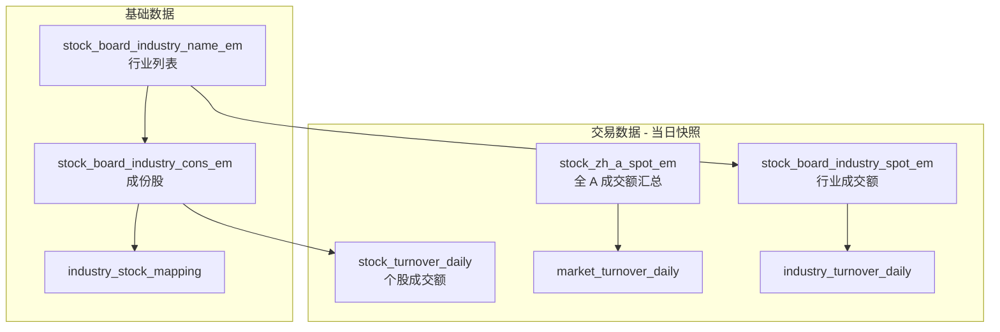

# 需求文档：A 股行业成交额分析（Phase 1）

> 版本：v0.1（待确认）  
> 状态：需求澄清中，**确认后再开发**

---

## 1. 项目目标

基于东方财富行业板块体系，构建一套**可落地的当日交易数据快照**，用于：

1. 建立**行业 ↔ 个股**基础映射关系；
2. 获取**指定交易日当天**（现阶段等价为「采集时刻的最近一个交易日」）的成交额数据；
3. 支持从 **A 股整体 → 行业 → 个股** 三层下钻查看成交额。

本阶段**不做**资金流量（主力净流入等）、历史趋势看板、付费数据对接。

---

## 2. 范围边界

### 2.1 本阶段包含

| 类别 | 内容 |
|------|------|
| 基础数据 | 行业代码、行业名称、个股代码、个股名称及映射关系 |
| 交易数据 | A 股总成交额、各行业成交额、各行业内个股成交额 |
| 时间维度 | **当日**（见 2.3 节说明） |
| 交付形态 | 结构化数据文件（CSV），可供直接查看 |

### 2.2 本阶段不包含

- 资金流向（买入/卖出/主力净额）
- 概念板块、地域板块（仅**行业板块**）
- 历史日期回溯（akshare 上述接口均为实时快照，无历史参数）
- Web 看板、定时任务、数据库（确认需求后的 Phase 1 实现可选）

### 2.3 关于「指定日期当天」的说明

用户定义的四个 akshare 接口均为**实时行情接口**，调用时不接受 `trade_date` 参数，返回的是**采集时刻最近一个交易日的盘中/收盘快照**。

因此本阶段的「当日」 operational 定义为：

| 字段 | 含义 |
|------|------|
| `trade_date` | 数据采集时由行情数据隐含的交易日（非节假日、非盘前则为上一交易日） |
| `snapshot_time` | 实际调用接口的 UTC/本地时间戳 |

若需真正的「历史某日」数据，必须：

- 每个交易日定时采集并落库，或
- 采购付费历史行情数据。

**请确认**：Phase 1 是否接受「每次运行获取最近交易日快照」，作为「当日」的降级实现？

---

## 3. 基础数据需求

### 3.1 业务定义

记录东方财富**行业板块**与**成份股**的一对多映射关系。

### 3.2 目标字段

| 字段名 | 类型 | 说明 | 示例 |
|--------|------|------|------|
| `industry_code` | string | 行业板块代码 | `BK0437` |
| `industry_name` | string | 行业板块名称 | `煤炭行业` |
| `stock_code` | string | 个股代码（6 位） | `600519` |
| `stock_name` | string | 个股名称 | `贵州茅台` |

### 3.3 数据来源与采集逻辑

| 步骤 | 接口 | 用途 |
|------|------|------|
| 1 | `ak.stock_board_industry_name_em()` | 获取全部行业列表（`板块代码`、`板块名称`） |
| 2 | `ak.stock_board_industry_cons_em(symbol=...)` | 按行业获取成份股（`代码`、`名称`） |

**参数说明**：

- `stock_board_industry_cons_em` 的 `symbol` 支持传入**行业名称**（如 `"小金属"`）或**行业代码**（如 `"BK1027"`）；
- 建议统一使用 `industry_code` 调用，避免重名歧义。

### 3.4 输出表：`industry_stock_mapping`

一行 = 一个行业中的一个成份股。

```
industry_code, industry_name, stock_code, stock_name
BK0437, 煤炭行业, 600123, 兰花科创
BK0437, 煤炭行业, 601001, 晋控煤业
...
```

### 3.5 数据量级（参考 akshare 文档）

| 维度 | 约计 |
|------|------|
| 行业数 | ~86 |
| 成份股 | 每行业数十只，全市场个股会因行业交叉而重复计数 |

> 注：同一只股票理论上只属于一个东方财富**行业**板块（与概念板块不同）。

---

## 4. 交易数据需求

时间维度：**指定日期当天**（现阶段 = 采集日快照）。  
核心指标：**成交额**（单位：元）。

### 4.1 A 股总体成交额

| 项目 | 说明 |
|------|------|
| **指标** | 全市场 A 股合计成交额 |
| **接口** | `ak.stock_zh_a_spot_em()` |
| **计算方式** | 对返回结果中每只个股的 `成交额` 字段 **求和** |
| **覆盖范围** | 沪深京 A 股（接口文档：单次返回所有沪深京 A 股上市公司） |

**输出表：`market_turnover_daily`**

| 字段 | 说明 |
|------|------|
| `trade_date` | 交易日（推断或标注） |
| `snapshot_time` | 采集时间 |
| `total_turnover` | Σ 成交额（元） |
| `stock_count` | 参与汇总的个股数 |

### 4.2 各行业板块成交额

| 项目 | 说明 |
|------|------|
| **指标** | 单个行业板块当日成交额 |
| **接口** | `ak.stock_board_industry_spot_em(symbol=行业名称或代码)` |
| **提取方式** | 返回为 `item / value` 键值对，取 `item == "成交额"` 的 `value` |
| **调用次数** | 每个行业调用 1 次（约 86 次） |

**接口返回示例**（小金属板块）：

```
item     value
成交额   2.165428e+10
成交量   1.386981e+07
...
```

**输出表：`industry_turnover_daily`**

| 字段 | 说明 |
|------|------|
| `trade_date` | 交易日 |
| `snapshot_time` | 采集时间 |
| `industry_code` | 行业代码 |
| `industry_name` | 行业名称 |
| `turnover` | 成交额（元） |

### 4.3 各行业内个股成交额

| 项目 | 说明 |
|------|------|
| **指标** | 行业成份股各自的成交额 |
| **接口** | `ak.stock_board_industry_cons_em(symbol=...)` |
| **提取方式** | 直接取返回字段 `成交额` |
| **调用次数** | 每个行业 1 次（与映射共用同一次调用） |

**输出表：`stock_turnover_daily`**

| 字段 | 说明 |
|------|------|
| `trade_date` | 交易日 |
| `snapshot_time` | 采集时间 |
| `industry_code` | 行业代码 |
| `industry_name` | 行业名称 |
| `stock_code` | 个股代码 |
| `stock_name` | 个股名称 |
| `turnover` | 成交额（元） |

---

## 5. 接口字段对照（akshare 原始 → 统一字段）

### 5.1 `stock_board_industry_name_em`

| akshare 字段 | 统一字段 | 备注 |
|--------------|----------|------|
| 板块代码 | `industry_code` | |
| 板块名称 | `industry_name` | |
| 最新价、涨跌幅、总市值… | 本阶段**不采集** | 仅用于行业列表 |

### 5.2 `stock_board_industry_cons_em`

| akshare 字段 | 统一字段 | 备注 |
|--------------|----------|------|
| 代码 | `stock_code` | |
| 名称 | `stock_name` | |
| 成交额 | `turnover` | 交易数据 |
| 成交量、涨跌幅… | 本阶段**不采集** | 可 Phase 2 扩展 |

### 5.3 `stock_board_industry_spot_em`

| akshare 字段 | 统一字段 | 备注 |
|--------------|----------|------|
| item=成交额 → value | `turnover` | 需 pivot 提取 |
| item=成交量 → value | 不采集 | |

### 5.4 `stock_zh_a_spot_em`

| akshare 字段 | 统一字段 | 备注 |
|--------------|----------|------|
| 成交额 | `turnover` | 逐股汇总 |
| 代码 / 名称 | 可选扩展 | 本阶段大盘级仅要总和 |

---

## 6. 数据关系图



---

## 7. 衍生指标（分析层，可选）

在基础数据确认后，可计算：

| 指标 | 公式 |
|------|------|
| 行业占大盘比 | `industry_turnover / market_total_turnover` |
| 个股占行业比 | `stock_turnover / industry_turnover` |
| 个股占大盘比 | `stock_turnover / market_total_turnover` |

本阶段交付**原始成交额**即可，占比作为验证手段。

---

## 8. 交付物（确认后第一批）

| 文件 | 内容 |
|------|------|
| `data/industry_stock_mapping.csv` | 行业-个股映射 |
| `data/market_turnover_daily.csv` | 大盘成交额（1 行） |
| `data/industry_turnover_daily.csv` | 各行业成交额（~86 行） |
| `data/stock_turnover_daily.csv` | 各行业内个股成交额 |

附带 `data/README.md` 说明 `trade_date` 与 `snapshot_time` 含义。

---

## 9. 约束与风险

| 风险 | 说明 | 应对 |
|------|------|------|
| 接口无历史参数 | 只能获取「当前快照」 | 每日定时采集落库 |
| 东财接口限流 | 行业 spot 需 ~86 次请求 | 加间隔、重试；部署在**国内**服务器 |
| 海外 IP 不稳定 | 实测 Cloud Agent 环境连接失败 | **腾讯云国内 CVM** 拉取 |
| 盘中 vs 收盘 | 盘中数据随时间变化 | 建议固定 **15:30 后** 采集 |
| 行业成交额两种口径 | `spot_em` 板块指数成交额 vs 成份股 `成交额` 之和可能略有差异 | 以需求指定的 `spot_em` 为准；可用成份股求和做交叉校验 |

---

## 10. 待你确认的问题

1. **「当日」**：是否接受「采集时刻最近交易日快照」作为 Phase 1 的当日定义？
2. **A 股总成交额**：是否确认用 `stock_zh_a_spot_em` 的 `成交额` **求和**？（覆盖沪深京 A 股）
3. **行业成交额**：是否坚持用 `stock_board_industry_spot_em`（需 86 次调用），还是允许用成份股成交额**求和**作为备选？
4. **映射更新频率**：行业成份股是否每个交易日全量刷新？
5. **交付格式**：CSV 是否满足？是否需要 Excel？
6. **采集环境**：是否在腾讯云国内节点执行？（强烈建议）

---

## 11. 确认后的下一步

1. 按本文档实现一次性数据下载脚本；
2. 在腾讯云执行并将 `data/` 下 CSV 提供给你查看；
3. 校验：大盘成交额 ≈ 各行业成交额之和（允许小误差）；
4. 再讨论是否加落库、定时任务和趋势看板。
