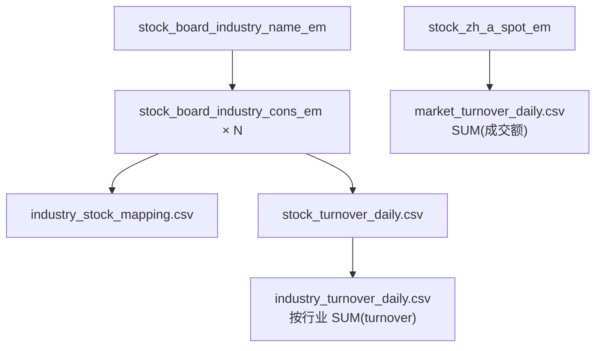

# 需求文档：A 股行业成交额分析（Phase 1）

> 版本：v0.2（已确认）  
> 状态：**需求已确认，进入实现阶段**

---

## 1. 项目目标

基于东方财富行业板块体系，构建一套**可落地的当日交易数据快照**，用于：

1. 建立**行业 ↔ 个股**基础映射关系；
2. 获取**指定交易日当天**（Phase 1 定义为「采集时刻最近交易日快照」）的成交额数据；
3. 支持从 **A 股整体 → 行业 → 个股** 三层下钻查看成交额。

本阶段**不做**资金流量（主力净流入等）、历史趋势看板、付费数据对接。

---

## 2. 范围边界

### 2.1 本阶段包含

| 类别 | 内容 |
|------|------|
| 基础数据 | 行业代码、行业名称、个股代码、个股名称及映射关系 |
| 交易数据 | A 股总成交额、各行业成交额、各行业内个股成交额 |
| 时间维度 | **当日**（见 2.3 节） |
| 交付形态 | CSV 文件 |
| 采集环境 | 腾讯云国内 CVM |
| 更新频率 | 每个交易日 **17:00 之后** 全量刷新 |

### 2.2 本阶段不包含

- 资金流向（买入/卖出/主力净额）
- 概念板块、地域板块（仅**行业板块**）
- 历史日期回溯（接口无历史参数，需每日采集积累）
- Excel 导出、Web 看板、数据库（后续 Phase 可选）

### 2.3 「当日」定义（已确认）

akshare 接口均为**实时快照**，不接受 `trade_date` 参数。

| 字段 | 含义 |
|------|------|
| `trade_date` | 采集时刻对应的**最近交易日** |
| `snapshot_time` | 实际调用接口的时间（建议 ≥ 17:00 CST） |

**已确认**：Phase 1 采用「采集时刻最近交易日快照」作为当日定义。

---

## 3. 基础数据需求

### 3.1 业务定义

记录东方财富**行业板块**与**成份股**的一对多映射关系。

### 3.2 目标字段

| 字段名 | 类型 | 说明 | 示例 |
|--------|------|------|------|
| `industry_code` | string | 行业板块代码 | `BK0437` |
| `industry_name` | string | 行业板块名称 | `煤炭行业` |
| `stock_code` | string | 个股代码（6 位） | `600519` |
| `stock_name` | string | 个股名称 | `贵州茅台` |

### 3.3 数据来源与采集逻辑

| 步骤 | 接口 | 用途 |
|------|------|------|
| 1 | `ak.stock_board_industry_name_em()` | 获取全部行业列表 |
| 2 | `ak.stock_board_industry_cons_em(symbol=industry_code)` | 按行业获取成份股 |

- `symbol` 统一使用 **行业代码**（如 `BK1027`），避免名称歧义。
- **更新频率（已确认）**：每个交易日 17:00 之后全量刷新。

### 3.4 输出表：`industry_stock_mapping.csv`

```
industry_code, industry_name, stock_code, stock_name
BK0437, 煤炭行业, 600123, 兰花科创
```

---

## 4. 交易数据需求

核心指标：**成交额**（元）。

### 4.1 A 股总体成交额（已确认）

| 项目 | 说明 |
|------|------|
| **接口** | `ak.stock_zh_a_spot_em()` |
| **计算** | 全部个股 `成交额` 字段 **求和** |
| **范围** | 沪深京 A 股 |

**输出：`market_turnover_daily.csv`**

| 字段 | 说明 |
|------|------|
| `trade_date` | 交易日 |
| `snapshot_time` | 采集时间 |
| `total_turnover` | 全市场成交额合计（元） |
| `stock_count` | 参与汇总个股数 |

### 4.2 各行业板块成交额（已确认）

| 项目 | 说明 |
|------|------|
| **计算方式** | 对该行业所有成份股的 `成交额` **求和** |
| **数据来源** | `stock_board_industry_cons_em`（与映射、个股成交额同一次调用） |
| **不使用** | `stock_board_industry_spot_em`（见 4.4 节备注） |

**输出：`industry_turnover_daily.csv`**

| 字段 | 说明 |
|------|------|
| `trade_date` | 交易日 |
| `snapshot_time` | 采集时间 |
| `industry_code` | 行业代码 |
| `industry_name` | 行业名称 |
| `turnover` | 成份股成交额之和（元） |
| `stock_count` | 成份股数量 |

### 4.3 各行业内个股成交额

| 项目 | 说明 |
|------|------|
| **接口** | `ak.stock_board_industry_cons_em(symbol=industry_code)` |
| **字段** | 直接取 `成交额` |

**输出：`stock_turnover_daily.csv`**

| 字段 | 说明 |
|------|------|
| `trade_date` | 交易日 |
| `snapshot_time` | 采集时间 |
| `industry_code` | 行业代码 |
| `industry_name` | 行业名称 |
| `stock_code` | 个股代码 |
| `stock_name` | 个股名称 |
| `turnover` | 成交额（元） |

### 4.4 备注：`stock_board_industry_spot_em`（不使用）

akshare 提供 `stock_board_industry_spot_em(symbol)` 可返回板块指数级成交额（`item/value` 键值对）。  
**本方案不使用**，原因：

- 与成份股成交额求和口径可能不一致；
- 需额外 ~86 次 API 请求；
- 成份股求和可与个股层数据自洽，便于下钻校验。

---

## 5. 接口字段对照

### 5.1 `stock_board_industry_name_em` — 使用

| akshare 字段 | 统一字段 |
|--------------|----------|
| 板块代码 | `industry_code` |
| 板块名称 | `industry_name` |

### 5.2 `stock_board_industry_cons_em` — 使用

| akshare 字段 | 统一字段 |
|--------------|----------|
| 代码 | `stock_code` |
| 名称 | `stock_name` |
| 成交额 | `turnover` |

### 5.3 `stock_board_industry_spot_em` — 不使用

仅作备查，Phase 1 不调用。

### 5.4 `stock_zh_a_spot_em` — 使用

| akshare 字段 | 统一字段 |
|--------------|----------|
| 成交额 | 汇总为 `total_turnover` |

---

## 6. 数据关系图



---

## 7. 已确认决策汇总

| 问题 | 决策 |
|------|------|
| 「当日」定义 | 采集时刻最近交易日快照 |
| A 股总成交额 | `stock_zh_a_spot_em` 成交额求和 |
| 行业成交额 | 成份股成交额求和；**不用** `stock_board_industry_spot_em` |
| 映射更新 | 每交易日 17:00 后全量刷新 |
| 交付格式 | CSV（暂不需要 Excel） |
| 采集环境 | 腾讯云国内节点 |

---

## 8. 交付物

| 文件 | 内容 |
|------|------|
| `data/industry_stock_mapping.csv` | 行业-个股映射 |
| `data/market_turnover_daily.csv` | 大盘成交额 |
| `data/industry_turnover_daily.csv` | 各行业成交额 |
| `data/stock_turnover_daily.csv` | 行业内个股成交额 |
| `data/README.md` | 采集说明 |

---

## 9. 约束与风险

| 风险 | 应对 |
|------|------|
| 接口无历史参数 | 每日 17:00 后定时采集落库 |
| 东财限流 | 成份股接口间隔 0.5～1s；国内 CVM |
| 行业成交额 vs 大盘 | 行业为成份股之和，与全 A 汇总口径不同，**不应强制相等** |
| 同一股票跨行业 | 东财行业板块下通常不重复；若重复以接口返回为准 |

---

## 10. 下一步

1. 实现 `scripts/fetch_daily_data.py`；
2. 在腾讯云 17:00 后执行；
3. 交付 CSV 供查看与校验；
4. 满意后进入 Phase 2（定时任务 + 历史归档）。
